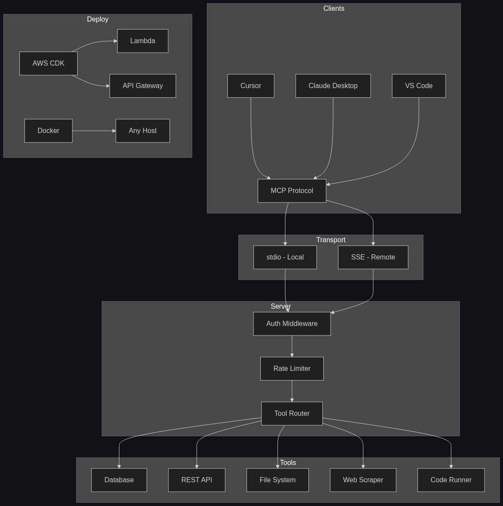

# MCP Server Starter Kit

A minimal [Model Context Protocol](https://modelcontextprotocol.io/) server starter in TypeScript. Build custom AI tools in minutes.

MCP lets AI assistants like Claude and Cursor call your code — database queries, API calls, file operations, anything you can write a function for. This starter gives you a working server with everything wired up so you can skip the boilerplate and start building.

## Quick Start

```bash
git clone https://github.com/tysoncung/mcp-server-starter.git
cd mcp-server-starter
npm install
```

Run in development mode (hot reload):

```bash
npm run dev
```

That's it. Your MCP server is running.

## What's Inside

A single example tool (`echo`) that demonstrates the pattern for defining MCP tools:

```typescript
server.tool(
  'echo',                                           // Tool name
  'Echo back the provided message',                 // Description for the AI
  { message: z.string().describe('Message text') }, // Input schema (Zod)
  async ({ message }) => {                          // Handler
    return { content: [{ type: 'text', text: `Echo: ${message}` }] };
  },
);
```

To add your own tools, follow the same pattern in `src/server.ts`. Define a name, describe what it does, declare the inputs with Zod, and write the handler.

## Add to Claude Desktop

Build the project first:

```bash
npm run build
```

Edit your Claude Desktop config file:

- **macOS:** `~/Library/Application Support/Claude/claude_desktop_config.json`
- **Windows:** `%APPDATA%\Claude\claude_desktop_config.json`

```json
{
  "mcpServers": {
    "starter": {
      "command": "node",
      "args": ["/absolute/path/to/mcp-server-starter/dist/index.js"]
    }
  }
}
```

Restart Claude Desktop and your tools will be available.

## Add to Cursor

Open Cursor Settings → MCP → Add Server, or edit `.cursor/mcp.json` in your project:

```json
{
  "mcpServers": {
    "starter": {
      "command": "node",
      "args": ["/absolute/path/to/mcp-server-starter/dist/index.js"]
    }
  }
}
```

## Scripts

| Command | Description |
|---|---|
| `npm run dev` | Start with hot reload (tsx watch) |
| `npm run build` | Compile TypeScript to `dist/` |
| `npm start` | Run compiled output |
| `npm test` | Run tests |

## Project Structure

```
src/
├── server.ts              # Server setup & tool definitions
├── index.ts               # Entry point (stdio transport)
└── __tests__/
    └── server.test.ts     # Tool tests
```

## Requirements

- Node.js ≥ 20
- npm

---

## Want More? 🚀

This free starter gets you up and running with one example tool and stdio transport. The **Pro Starter Kit** gives you everything you need to ship production MCP servers:

| | **Free** | **Pro** |
|---|:---:|:---:|
| Tools | 1 example | 5 production-ready templates |
| Tool templates | — | Database, REST API, filesystem, web scraper, code runner |
| Transport | stdio | stdio + SSE (remote clients) |
| Authentication | — | API key + JWT middleware |
| Rate limiting | — | ✅ Built-in |
| Logging | — | Structured logging middleware |
| Testing | Basic | Full test suite with Vitest |
| Docker | — | Dockerfile + docker-compose |
| Deployment | — | AWS CDK infrastructure |
| Error handling | Basic | Production-grade with retries |
| Linting | — | ESLint + Prettier configured |

### What's in Pro?

- **5 tool templates** you can copy and customize — not just echo, but real patterns for databases, REST APIs, file systems, web scraping, and code execution
- **Dual transport** — serve over stdio for local use and SSE for remote clients, both from the same codebase
- **Auth middleware** — API key and JWT authentication out of the box
- **Rate limiting** — protect your server from runaway AI requests
- **Structured logging** — know exactly what your server is doing in production
- **Docker + AWS CDK** — deploy anywhere with one command
- **Full test suite** — every tool tested, CI-ready

### [👉 Get the Pro Starter Kit — $49 →](https://tysoncung.gumroad.com)

Skip the hours of setup. Start building production MCP tools today.

---

## License

MIT — see [LICENSE](LICENSE)

## 📖 Read the Full Story

**[I Built a Production MCP Server Kit — Here's What I Learned](https://dev.to/tyson_cung/i-built-a-production-mcp-server-kit-heres-what-i-learned-28km)** — the design decisions, architecture, and lessons from building production MCP servers.


